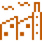
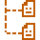

#  Корпоративный веб-сайт ООО «Дальмосбур»

<hr style="border: none; height: 4px; background-color: #0F2A4D; width: 100%;">


##  О проекте 

Данный репозиторий содержит исходный код корпоративного веб-сайта для малого предприятия **ООО «Дальмосбур»**. Компания занимается буровыми и буро-взрывными работами на крупнейших горнодобывающих объектах Российской Федерации.

**Цель разработки:** Создание современного информационного ресурса для повышения узнаваемости компании, демонстрации опыта и привлечения новых клиентов.

<hr style="border: none; height: 2px; background-color: #0F2A4D; width: 100%;">

##  Основные возможности

Сайт реализует следующий функционал согласно Техническому Заданию:

- **Адаптивный дизайн:** Корректное отображение на ПК, планшетах и смартфонах.
- **Информативная структура:**
  - **Главная:** Кратко о компании, услуги, проекты/объекты, преимущества, контакты.
  - **О компании:** История, миссия, ключевые компетенции.
  - **Услуги:** Список услуг предприятия с подробным описанием каждой услуги при переходе по ссылке.
  - **Проекты/Объекты:** Список выполненных работ предприятия с подробным описанием каждой работы при переходе по ссылке.
  - **Контакты:** Адрес, телефон, email, социальные сети.
- **Обратная связь:** Форма для отправки сообщений администратору с валидацией введенных данных (форма для потенциального заказчика и форма для потенциальных сотрудников).
- **Безопасность:** Защита от некорректного ввода и минимизация уязвимостей.
  
 <hr style="border: none; height: 2px; background-color: #0F2A4D; width: 100%;">

##  Технологии

В проекте использован следующий стек технологий:

-   **Next.js** — производительный React-фреймворк (SSR, SSG, роутинг);
-   **TypeScript** — статическая типизация для надежности и поддержки кода;
-   **Tailwind CSS** — утилитарный CSS-фреймворк для быстрой и адаптивной верстки;
-   **HTML5** — семантическая разметка компонентов (JSX)

<hr style="border: none; height: 2px; background-color: #0F2A4D; width: 100%;">

##  Структура проекта


```text
/
├── .next/                    # Папка сборки Next.js (генерируется автоматически, не редактируется)
├── icons/                    # SVG-иконки для README
├── public/                   # Статические файлы (изображения, иконки, favicon, документы)
├── src/                      # Исходный код проекта
│   ├── app/                  # Маршрутизация и страницы (Next.js App Router)
│   ├── components/           # Переиспользуемые React-компоненты (Header, Footer, Form и т.д.)
│   ├── config/               # Конфигурационные файлы проекта (константы, настройки)
│   ├── data/                 # Статические данные (тексты, списки услуг, проекты)
│   ├── pages/                # Дополнительные страницы (О компании, Услуги, Контакты)
│   └── types/                # TypeScript типы и интерфейсы для типизации данных
├── .gitignore                # Файл игнорирования для Git (исключает .next, node_modules и др.)
├── eslint.config.mjs         # Конфигурация линтера ESLint для проверки качества кода
├── next-env.d.ts             # Типизация переменных окружения для Next.js
├── next.config.js            # Конфигурация Next.js (маршруты, редиректы, настройки сборки)
├── package-lock.json         # Фиксация версий зависимостей (генерируется автоматически)
├── package.json              # Зависимости проекта, скрипты запуска и сборки
├── postcss.config.mjs        # Конфигурация PostCSS для обработки CSS (используется Tailwind)
├── README.md                 # Документация проекта (описание проекта)
├── tailwind.config.ts        # Конфигурация Tailwind CSS
└── tsconfig.json             # Конфигурация TypeScript (правила компиляции, пути, строгость типов)   
```